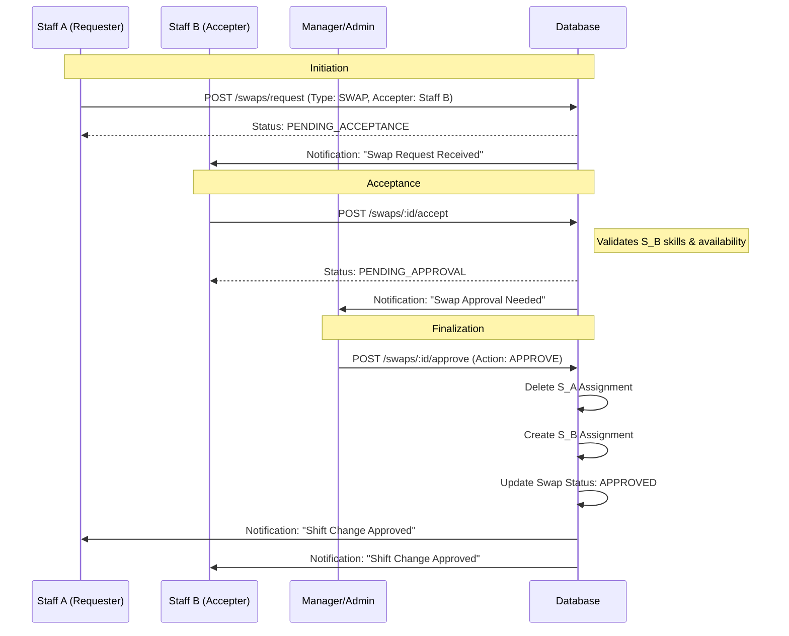

# Shift Swap & Drop Workflow Documentation

This document describes the ShiftSync Shift Swap and Drop API, including the lifecycle of requests and the roles of Staff, Managers, and Admins.

## 1. Overview & Terminology
- **Swap**: A person-to-person trade. Staff A asks Staff B to take their shift.
- **Drop**: An open request. Staff A asks to be removed from a shift, potentially leaving it open for any qualified staff or requiring manager action.
- **Requester**: The staff member initiating the swap/drop.
- **Accepter**: The staff member taking over the shift in a swap.
- **Approver**: A Manager or Admin who finalizes the request.

---

## 2. API Endpoints by Role

### Staff (The Field)
| Method | Endpoint | Request Body | Description |
| :--- | :--- | :--- | :--- |
| `POST` | `/api/swaps/request` | `{ "shiftId": "uuid", "type": "SWAP" or "DROP", "accepterProfileId": "uuid" (optional) }` | Create a `SWAP` or `DROP` request. |
| `POST` | `/api/swaps/:id/accept` | *None* | Accept a `SWAP` request from another staff member. |
| `GET` | `/api/swaps/me` | *None* | View all swap requests involving the current staff member. |

### Managers & Admins (The Overlook)
| Method | Endpoint | Request Body | Description |
| :--- | :--- | :--- | :--- |
| `GET` | `/api/swaps` | *None* | List all system-wide swap/drop requests. |
| `POST` | `/api/swaps/:id/approve` | `{ "action": "APPROVE" or "REJECT", "comment": "String" (optional) }` | **Approve** or **Reject** a request. |
| `PUT` | `/api/shifts/:id` | `{ ...shiftData... }` | Updating a shift automatically **cancels** pending swaps/drops for that shift. |
| `GET` | `/api/admin/audit` | *None* | View audit logs for shift and swap changes. |

---

## 3. The Lifecycle Flow

---

## 4. Key Business Rules & Validations

### For Staff
- **Limits**: A staff member can have a maximum of **3 pending** swap/drop requests at any time.
- **Acceptance Validation**: When Staff B accepts a swap, the system runs the `SchedulingService` to ensure:
    - They have the required **Skills**.
    - They are **Certified** for the location.
    - No **Overlapping** shifts (Double-booking).
    - **10-hour rest** rule is maintained.
    - They are within **Weekly/Daily Hour** limits (Compliance).

### For Managers
- **Location-Based**: Managers can only approve/reject swaps for locations they manage.
- **Audit Logging**: Every shift creation and swap approval is logged in the `AuditLog` table for accountability.
- **Override Potential**: Admins have global visibility and can approve swaps across any location.

---

## 5. Data Model (SwapRequest)
- `shiftId`: Target shift.
- `requesterId`: Who wants out.
- `accepterId`: Who wants in (optional for DROP).
- `type`: `SWAP` or `DROP`.
- `status`: `PENDING_ACCEPTANCE` -> `PENDING_APPROVAL` -> `APPROVED`/`REJECTED`.

---

## 6. Comprehensive Shift Actions

Beyond swapping, the following actions can be performed on shifts:

### Management (Admin/Manager)
- **Create**: Define shift times, locations, and required skills (`POST /api/shifts`).
- **Update**: Modify shift details (`PUT /api/shifts/:id`). *Note: This cancels any pending swaps for that shift.*
- **Assign**: Manually assign staff to a shift (`POST /api/shifts/:id/assign`). Includes automated conflict checking.
- **Publish**: Finalize and release the schedule for a specific period and location (`POST /api/shifts/publish`).
- **Audit**: Review the history of all changes and assignments for a shift (`GET /api/audit`).

### Analytics (Admin/Manager)
- **Fairness Report**: Analyze the distribution of hours and premium (weekend) shifts among staff (`GET /api/analytics/fairness`).
- **On-Duty Dashboard**: See who is currently clocked in/working across all locations (`GET /api/analytics/on-duty`).
- **Compliance Metrics**: Monitor health scores for rest rules (11h between shifts) and weekly hour limits (`GET /api/analytics/compliance`).

### Staff Experience
- **View Schedule**: Browse available and assigned shifts (`GET /api/shifts`).
- **My Shifts**: View personal upcoming assignments (`GET /api/shifts/me`).
- **Swap/Drop**: Initiate the trade or release of an assigned shift (`POST /api/swaps/request`).
